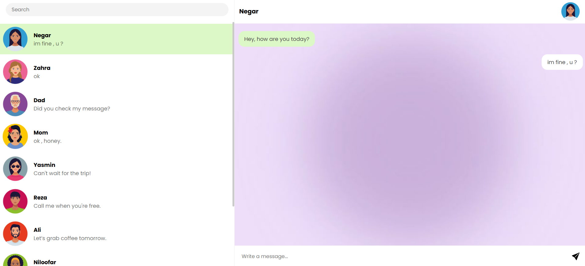

# Telegram project Website

**Live Demo:** [Telegram Project](https://negarniazadeh.github.io/Telegram-project/)

---

## Features

- **Responsive Design**
- **User Search** — Filter users in the contacts list by name.
- **Send Messages** — Write and send messages .
- **Last Message Preview** — Shows the last sent message under each user's profile.
- **Reorder List by Last Message** — Users move to the top of the list based on the latest sent message.
- **LocalStorage Support** — Messages are saved locally and persist on refresh.
- **One-way Messaging** — Only you can send messages to users (simulated).

---

## Preview

Here is a screenshot of the UI for better visualization:

---

## Tech Stack

- HTML5
- CSS3
- JavaScript (Vanilla)
- LocalStorage
